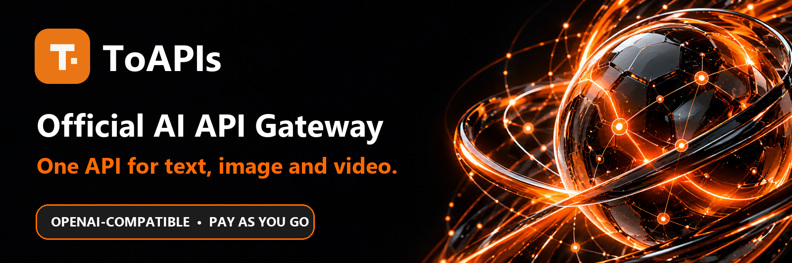

<div align="center">

<a href="https://toapis.com/en?utm_source=github&utm_medium=organic_profile&utm_campaign=gh_org"></a>

[](https://toapis.com/console/token?utm_source=github&utm_medium=organic_profile&utm_campaign=gh_org) [](https://toapis.com/en/market?utm_source=github&utm_medium=organic_profile&utm_campaign=gh_org) [](https://docs.toapis.com/docs/en/quickstart) [](https://toapis.com/en?utm_source=github&utm_medium=organic_profile&utm_campaign=gh_org) [](https://toapis.com/en/pricing?utm_source=github&utm_medium=organic_profile&utm_campaign=gh_org)

[](https://toapis.com) [](https://discord.gg/hvnszCrJ73) [](https://x.com/toapisai) [](https://github.com/ToAPIs-2025)

[](README.md) [](README_zh-CN.md) [](README_ja.md) [](README_ko.md) [](README_ru.md)

One API for text, image, video and Suno music generation. Keep your OpenAI-compatible chat integration and explore dedicated image and video APIs.

</div>

---

## Flagship models, one endpoint

| Category | Model families |
| :--- | :--- |
| **Text** | [](https://toapis.com/en/market?utm_source=github&utm_medium=organic_profile&utm_campaign=gh_org) [](https://toapis.com/en/market?utm_source=github&utm_medium=organic_profile&utm_campaign=gh_org) [](https://toapis.com/en/market?utm_source=github&utm_medium=organic_profile&utm_campaign=gh_org) [](https://toapis.com/en/market?utm_source=github&utm_medium=organic_profile&utm_campaign=gh_org) |
| **Image** | [](https://toapis.com/en/market?utm_source=github&utm_medium=organic_profile&utm_campaign=gh_org) [](https://toapis.com/en/market?utm_source=github&utm_medium=organic_profile&utm_campaign=gh_org) [](https://toapis.com/en/market?utm_source=github&utm_medium=organic_profile&utm_campaign=gh_org) [](https://toapis.com/en/market?utm_source=github&utm_medium=organic_profile&utm_campaign=gh_org) |
| **Video** | [](https://toapis.com/en/market?utm_source=github&utm_medium=organic_profile&utm_campaign=gh_org) [](https://toapis.com/en/market?utm_source=github&utm_medium=organic_profile&utm_campaign=gh_org) [](https://toapis.com/en/market?utm_source=github&utm_medium=organic_profile&utm_campaign=gh_org) [](https://toapis.com/en/market?utm_source=github&utm_medium=organic_profile&utm_campaign=gh_org) |
| **Audio · music** | [](https://toapis.com/en/model-guide/suno?utm_source=github&utm_medium=organic_profile&utm_campaign=gh_org) |

<div align="center">

[](https://toapis.com/en/market?utm_source=github&utm_medium=organic_profile&utm_campaign=gh_org)

</div>

---

## Clear pricing, pay as you go

<a href="https://toapis.com/en/pricing?utm_source=github&utm_medium=organic_profile&utm_campaign=gh_org"></a>

No monthly subscription. Compare live prices and billing units before selecting a model. Prices can vary by user group and promotion. [→ PRICING](https://toapis.com/en/pricing?utm_source=github&utm_medium=organic_profile&utm_campaign=gh_org)

<div align="center">

[](https://toapis.com/console/token?utm_source=github&utm_medium=organic_profile&utm_campaign=gh_org) [](https://toapis.com/en/pricing?utm_source=github&utm_medium=organic_profile&utm_campaign=gh_org)

</div>

---

## Start building

1. [Create an API key.](https://toapis.com/console/token?utm_source=github&utm_medium=organic_profile&utm_campaign=gh_org)
2. [Choose a model and review its current price.](https://toapis.com/en/market?utm_source=github&utm_medium=organic_profile&utm_campaign=gh_org)
3. [Follow the quickstart for text, image or video.](https://docs.toapis.com/docs/en/quickstart)

```python
from openai import OpenAI

client = OpenAI(base_url="https://toapis.com/v1", api_key="YOUR_API_KEY")
response = client.chat.completions.create(
    model="gpt-5.6-terra",
    messages=[{"role": "user", "content": "Hello from ToAPIs!"}],
)
print(response.choices[0].message.content)
```

For image and video requests, use the dedicated generation APIs and follow the task status flow in the docs.

---

<div align="center"><sub>Built by the ToAPIs team · <a href="https://toapis.com">toapis.com</a> · <a href="mailto:support@toapis.com">Contact support</a></sub></div>
