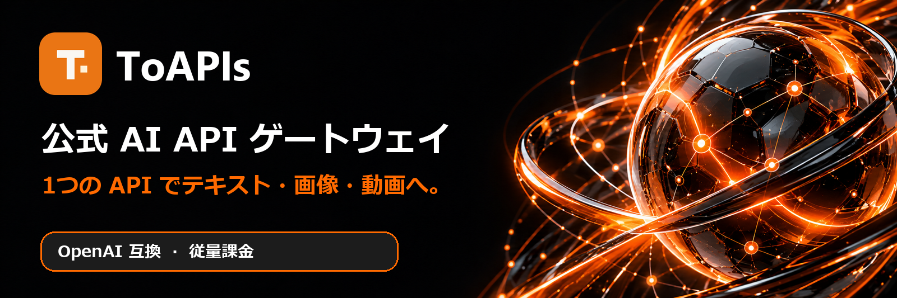
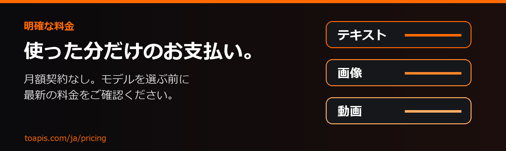

<div align="center">

<a href="https://toapis.com/ja?utm_source=github&utm_medium=organic_profile&utm_campaign=gh_org"></a>

[](https://toapis.com/dashboard/tokens?utm_source=github&utm_medium=organic_profile&utm_campaign=gh_org) [](https://toapis.com/ja/market?utm_source=github&utm_medium=organic_profile&utm_campaign=gh_org) [](https://docs.toapis.com/docs/ja/quickstart) [](https://toapis.com/ja?utm_source=github&utm_medium=organic_profile&utm_campaign=gh_org) [](https://toapis.com/ja/pricing?utm_source=github&utm_medium=organic_profile&utm_campaign=gh_org)

ログイン後、**Dashboard → API Tokens** を開いて API キーを作成してください。

[](https://toapis.com) [](https://discord.gg/hvnszCrJ73) [](https://x.com/toapisai) [](https://t.me/ToAPIsofficial)

[](README.md) [](README_zh-CN.md) [](README_ja.md) [](README_ko.md) [](README_ru.md)

テキスト・画像・動画モデルと Suno の音楽生成を一つの API ゲートウェイで。チャットは OpenAI 互換、画像と動画は専用 API で利用できます。

</div>

---

## 主要モデルへ、一つの入口から

| カテゴリ | モデルファミリー |
| :--- | :--- |
| **テキスト** | [](https://toapis.com/ja/market?utm_source=github&utm_medium=organic_profile&utm_campaign=gh_org) [](https://toapis.com/ja/market?utm_source=github&utm_medium=organic_profile&utm_campaign=gh_org) [](https://toapis.com/ja/market?utm_source=github&utm_medium=organic_profile&utm_campaign=gh_org) [](https://toapis.com/ja/market?utm_source=github&utm_medium=organic_profile&utm_campaign=gh_org) |
| **画像** | [](https://toapis.com/ja/market?utm_source=github&utm_medium=organic_profile&utm_campaign=gh_org) [](https://toapis.com/ja/market?utm_source=github&utm_medium=organic_profile&utm_campaign=gh_org) [](https://toapis.com/ja/market?utm_source=github&utm_medium=organic_profile&utm_campaign=gh_org) [](https://toapis.com/ja/market?utm_source=github&utm_medium=organic_profile&utm_campaign=gh_org) |
| **動画** | [](https://toapis.com/ja/market?utm_source=github&utm_medium=organic_profile&utm_campaign=gh_org) [](https://toapis.com/ja/market?utm_source=github&utm_medium=organic_profile&utm_campaign=gh_org) [](https://toapis.com/ja/market?utm_source=github&utm_medium=organic_profile&utm_campaign=gh_org) [](https://toapis.com/ja/market?utm_source=github&utm_medium=organic_profile&utm_campaign=gh_org) |
| **音声・音楽生成** | [](https://toapis.com/en/model-guide/suno?utm_source=github&utm_medium=organic_profile&utm_campaign=gh_org) |

<div align="center">

[](https://toapis.com/ja/market?utm_source=github&utm_medium=organic_profile&utm_campaign=gh_org)

</div>

---

## 明確な料金、従量課金

<a href="https://toapis.com/ja/pricing?utm_source=github&utm_medium=organic_profile&utm_campaign=gh_org"></a>

月額契約は不要です。モデル選択前に最新の料金と課金単位を確認できます。料金はユーザー区分やキャンペーンにより変わる場合があります。 [→ 料金](https://toapis.com/ja/pricing?utm_source=github&utm_medium=organic_profile&utm_campaign=gh_org)

<div align="center">

[](https://toapis.com/dashboard/tokens?utm_source=github&utm_medium=organic_profile&utm_campaign=gh_org) [](https://toapis.com/ja/pricing?utm_source=github&utm_medium=organic_profile&utm_campaign=gh_org)

</div>

---

## 開発を始める

1. [ログイン後、Dashboard → API Tokens で API キーを作成します。](https://toapis.com/dashboard/tokens?utm_source=github&utm_medium=organic_profile&utm_campaign=gh_org)
2. [モデルを選び、現在の料金を確認します。](https://toapis.com/ja/market?utm_source=github&utm_medium=organic_profile&utm_campaign=gh_org)
3. [クイックスタートに沿ってテキスト・画像・動画 API を利用します。](https://docs.toapis.com/docs/ja/quickstart)

```python
from openai import OpenAI

client = OpenAI(base_url="https://toapis.com/v1", api_key="YOUR_API_KEY")
response = client.chat.completions.create(
    model="gpt-5.6-terra",
    messages=[{"role": "user", "content": "Hello from ToAPIs!"}],
)
print(response.choices[0].message.content)
```

画像と動画には専用の生成 API を使用し、ドキュメントに従って非同期タスクの状態を確認してください。

---

<div align="center"><sub>ToAPIs チームが開発 · <a href="https://toapis.com">toapis.com</a> · <a href="mailto:support@toapis.com">サポートに連絡</a></sub></div>
