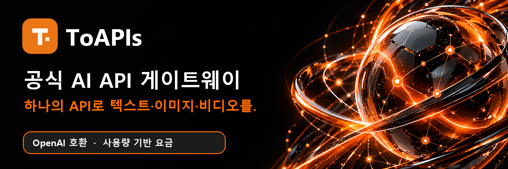
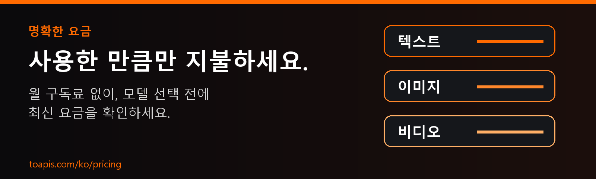

<div align="center">

<a href="https://toapis.com/ko?utm_source=github&utm_medium=organic_profile&utm_campaign=gh_org"></a>

[](https://toapis.com/dashboard/tokens?utm_source=github&utm_medium=organic_profile&utm_campaign=gh_org) [](https://toapis.com/ko/market?utm_source=github&utm_medium=organic_profile&utm_campaign=gh_org) [](https://docs.toapis.com/docs/ko/quickstart) [](https://toapis.com/ko?utm_source=github&utm_medium=organic_profile&utm_campaign=gh_org) [](https://toapis.com/ko/pricing?utm_source=github&utm_medium=organic_profile&utm_campaign=gh_org)

로그인 후 **Dashboard → API Tokens**에서 API 키를 생성하세요.

[](https://toapis.com) [](https://discord.gg/hvnszCrJ73) [](https://x.com/toapisai) [](https://github.com/ToAPIs-2025)

[](README.md) [](README_zh-CN.md) [](README_ja.md) [](README_ko.md) [](README_ru.md)

하나의 API 게이트웨이로 텍스트, 이미지, 비디오 모델과 Suno 음악 생성을 사용하세요. 채팅은 OpenAI 호환 방식으로, 이미지와 비디오는 전용 API로 호출합니다.

</div>

---

## 주요 모델을 하나의 엔드포인트에서

| 분류 | 모델 계열 |
| :--- | :--- |
| **텍스트** | [](https://toapis.com/ko/market?utm_source=github&utm_medium=organic_profile&utm_campaign=gh_org) [](https://toapis.com/ko/market?utm_source=github&utm_medium=organic_profile&utm_campaign=gh_org) [](https://toapis.com/ko/market?utm_source=github&utm_medium=organic_profile&utm_campaign=gh_org) [](https://toapis.com/ko/market?utm_source=github&utm_medium=organic_profile&utm_campaign=gh_org) |
| **이미지** | [](https://toapis.com/ko/market?utm_source=github&utm_medium=organic_profile&utm_campaign=gh_org) [](https://toapis.com/ko/market?utm_source=github&utm_medium=organic_profile&utm_campaign=gh_org) [](https://toapis.com/ko/market?utm_source=github&utm_medium=organic_profile&utm_campaign=gh_org) [](https://toapis.com/ko/market?utm_source=github&utm_medium=organic_profile&utm_campaign=gh_org) |
| **비디오** | [](https://toapis.com/ko/market?utm_source=github&utm_medium=organic_profile&utm_campaign=gh_org) [](https://toapis.com/ko/market?utm_source=github&utm_medium=organic_profile&utm_campaign=gh_org) [](https://toapis.com/ko/market?utm_source=github&utm_medium=organic_profile&utm_campaign=gh_org) [](https://toapis.com/ko/market?utm_source=github&utm_medium=organic_profile&utm_campaign=gh_org) |
| **오디오 · 음악 생성** | [](https://toapis.com/en/model-guide/suno?utm_source=github&utm_medium=organic_profile&utm_campaign=gh_org) |

<div align="center">

[](https://toapis.com/ko/market?utm_source=github&utm_medium=organic_profile&utm_campaign=gh_org)

</div>

---

## 명확한 요금, 사용량 기반 결제

<a href="https://toapis.com/ko/pricing?utm_source=github&utm_medium=organic_profile&utm_campaign=gh_org"></a>

월 구독이 필요하지 않습니다. 모델 선택 전에 최신 요금과 과금 단위를 확인하세요. 실제 요금은 사용자 그룹과 프로모션에 따라 달라질 수 있습니다. [→ 요금](https://toapis.com/ko/pricing?utm_source=github&utm_medium=organic_profile&utm_campaign=gh_org)

<div align="center">

[](https://toapis.com/dashboard/tokens?utm_source=github&utm_medium=organic_profile&utm_campaign=gh_org) [](https://toapis.com/ko/pricing?utm_source=github&utm_medium=organic_profile&utm_campaign=gh_org)

</div>

---

## 개발 시작하기

1. [로그인 후 Dashboard → API Tokens에서 API 키를 생성합니다.](https://toapis.com/dashboard/tokens?utm_source=github&utm_medium=organic_profile&utm_campaign=gh_org)
2. [모델을 선택하고 현재 요금을 확인합니다.](https://toapis.com/ko/market?utm_source=github&utm_medium=organic_profile&utm_campaign=gh_org)
3. [빠른 시작 문서에 따라 텍스트, 이미지 또는 비디오 API를 사용합니다.](https://docs.toapis.com/docs/ko/quickstart)

```python
from openai import OpenAI

client = OpenAI(base_url="https://toapis.com/v1", api_key="YOUR_API_KEY")
response = client.chat.completions.create(
    model="gpt-5.6-terra",
    messages=[{"role": "user", "content": "Hello from ToAPIs!"}],
)
print(response.choices[0].message.content)
```

이미지와 비디오에는 전용 생성 API를 사용하고 문서에 따라 비동기 작업 상태를 확인하세요.

---

<div align="center"><sub>ToAPIs 팀 제작 · <a href="https://toapis.com">toapis.com</a> · <a href="mailto:support@toapis.com">지원 문의</a></sub></div>
