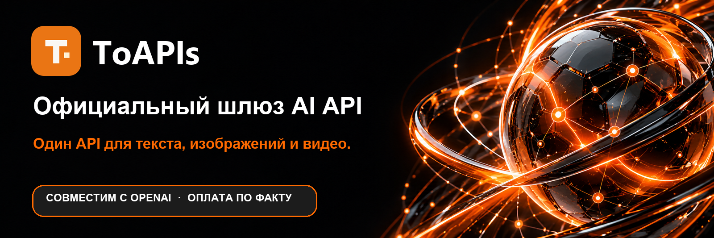
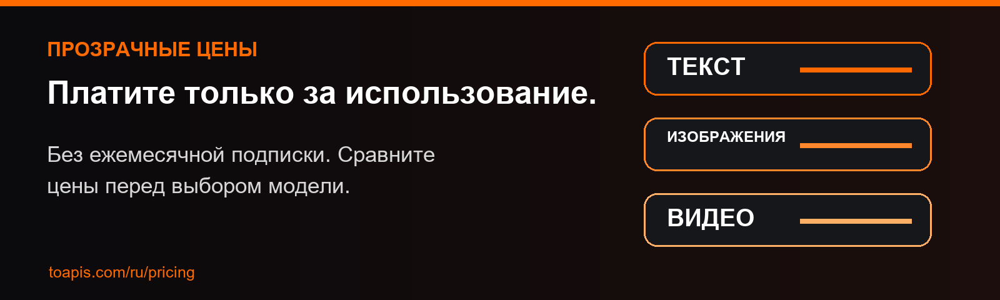

<div align="center">

<a href="https://toapis.com/ru?utm_source=github&utm_medium=organic_profile&utm_campaign=gh_org"></a>

[](https://toapis.com/dashboard/tokens?utm_source=github&utm_medium=organic_profile&utm_campaign=gh_org) [](https://toapis.com/ru/market?utm_source=github&utm_medium=organic_profile&utm_campaign=gh_org) [](https://docs.toapis.com/docs/ru/quickstart) [](https://toapis.com/ru?utm_source=github&utm_medium=organic_profile&utm_campaign=gh_org) [](https://toapis.com/ru/pricing?utm_source=github&utm_medium=organic_profile&utm_campaign=gh_org)

После входа откройте **Dashboard → API Tokens** и создайте API-ключ.

[](https://toapis.com) [](https://discord.gg/hvnszCrJ73) [](https://x.com/toapisai) [](https://t.me/ToAPIsofficial)

[](README.md) [](README_zh-CN.md) [](README_ja.md) [](README_ko.md) [](README_ru.md)

Один API-шлюз для текстовых, графических и видеомоделей, а также генерации музыки Suno. Для чата используйте совместимый с OpenAI интерфейс, для изображений и видео — отдельные API.

</div>

---

## Ведущие модели через единый шлюз

| Категория | Семейства моделей |
| :--- | :--- |
| **Текст** | [](https://toapis.com/ru/market?utm_source=github&utm_medium=organic_profile&utm_campaign=gh_org) [](https://toapis.com/ru/market?utm_source=github&utm_medium=organic_profile&utm_campaign=gh_org) [](https://toapis.com/ru/market?utm_source=github&utm_medium=organic_profile&utm_campaign=gh_org) [](https://toapis.com/ru/market?utm_source=github&utm_medium=organic_profile&utm_campaign=gh_org) |
| **Изображения** | [](https://toapis.com/ru/market?utm_source=github&utm_medium=organic_profile&utm_campaign=gh_org) [](https://toapis.com/ru/market?utm_source=github&utm_medium=organic_profile&utm_campaign=gh_org) [](https://toapis.com/ru/market?utm_source=github&utm_medium=organic_profile&utm_campaign=gh_org) [](https://toapis.com/ru/market?utm_source=github&utm_medium=organic_profile&utm_campaign=gh_org) |
| **Видео** | [](https://toapis.com/ru/market?utm_source=github&utm_medium=organic_profile&utm_campaign=gh_org) [](https://toapis.com/ru/market?utm_source=github&utm_medium=organic_profile&utm_campaign=gh_org) [](https://toapis.com/ru/market?utm_source=github&utm_medium=organic_profile&utm_campaign=gh_org) [](https://toapis.com/ru/market?utm_source=github&utm_medium=organic_profile&utm_campaign=gh_org) |
| **Аудио · генерация музыки** | [](https://toapis.com/en/model-guide/suno?utm_source=github&utm_medium=organic_profile&utm_campaign=gh_org) |

<div align="center">

[](https://toapis.com/ru/market?utm_source=github&utm_medium=organic_profile&utm_campaign=gh_org)

</div>

---

## Прозрачные цены и оплата по факту использования

<a href="https://toapis.com/ru/pricing?utm_source=github&utm_medium=organic_profile&utm_campaign=gh_org"></a>

Без ежемесячной подписки. Сравните актуальные цены и единицы тарификации перед выбором модели. Итоговая цена может зависеть от группы пользователя и акции. [→ ЦЕНЫ](https://toapis.com/ru/pricing?utm_source=github&utm_medium=organic_profile&utm_campaign=gh_org)

<div align="center">

[](https://toapis.com/dashboard/tokens?utm_source=github&utm_medium=organic_profile&utm_campaign=gh_org) [](https://toapis.com/ru/pricing?utm_source=github&utm_medium=organic_profile&utm_campaign=gh_org)

</div>

---

## Начните разработку

1. [После входа откройте Dashboard → API Tokens и создайте API-ключ.](https://toapis.com/dashboard/tokens?utm_source=github&utm_medium=organic_profile&utm_campaign=gh_org)
2. [Выберите модель и проверьте текущую цену.](https://toapis.com/ru/market?utm_source=github&utm_medium=organic_profile&utm_campaign=gh_org)
3. [Следуйте руководству для текстового, графического или видео API.](https://docs.toapis.com/docs/ru/quickstart)

```python
from openai import OpenAI

client = OpenAI(base_url="https://toapis.com/v1", api_key="YOUR_API_KEY")
response = client.chat.completions.create(
    model="gpt-5.6-terra",
    messages=[{"role": "user", "content": "Hello from ToAPIs!"}],
)
print(response.choices[0].message.content)
```

Для изображений и видео используйте отдельные API генерации и проверяйте состояние асинхронной задачи по документации.

---

<div align="center"><sub>Создано командой ToAPIs · <a href="https://toapis.com">toapis.com</a> · <a href="mailto:support@toapis.com">Связаться с поддержкой</a></sub></div>
