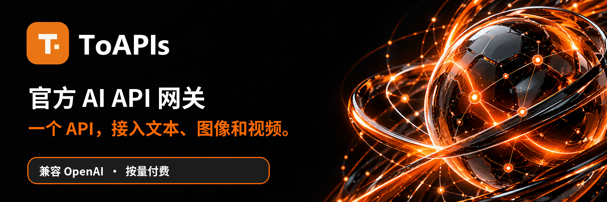
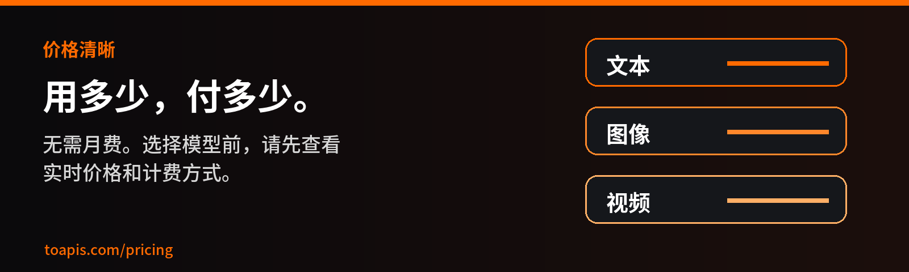

<div align="center">

<a href="https://toapis.com?utm_source=github&utm_medium=organic_profile&utm_campaign=gh_org"></a>

[](https://toapis.com/dashboard/tokens?utm_source=github&utm_medium=organic_profile&utm_campaign=gh_org) [](https://toapis.com/market?utm_source=github&utm_medium=organic_profile&utm_campaign=gh_org) [](https://docs.toapis.com/docs/cn/quickstart) [](https://toapis.com?utm_source=github&utm_medium=organic_profile&utm_campaign=gh_org) [](https://toapis.com/pricing?utm_source=github&utm_medium=organic_profile&utm_campaign=gh_org)

[](https://toapis.com) [](https://discord.gg/hvnszCrJ73) [](https://x.com/toapisai) [](https://github.com/ToAPIs-2025)

[](README.md) [](README_zh-CN.md) [](README_ja.md) [](README_ko.md) [](README_ru.md)

**中国境内访问提示：以下按钮、文档链接和代码示例默认使用 `.com` 域名；在中国境内访问时，请将官网及 API 地址改为 [toapis.cn](https://toapis.cn)，文档地址改为 [docs.toapis.cn](https://docs.toapis.cn/)。**

一个 API 网关，接入文本、图像、视频及 Suno 音乐生成。文本调用兼容 OpenAI SDK，图像和视频使用对应的专用接口。

</div>

---

## 主流模型，统一入口

| 类别 | 模型系列 |
| :--- | :--- |
| **文本** | [](https://toapis.com/market?utm_source=github&utm_medium=organic_profile&utm_campaign=gh_org) [](https://toapis.com/market?utm_source=github&utm_medium=organic_profile&utm_campaign=gh_org) [](https://toapis.com/market?utm_source=github&utm_medium=organic_profile&utm_campaign=gh_org) [](https://toapis.com/market?utm_source=github&utm_medium=organic_profile&utm_campaign=gh_org) |
| **图像** | [](https://toapis.com/market?utm_source=github&utm_medium=organic_profile&utm_campaign=gh_org) [](https://toapis.com/market?utm_source=github&utm_medium=organic_profile&utm_campaign=gh_org) [](https://toapis.com/market?utm_source=github&utm_medium=organic_profile&utm_campaign=gh_org) [](https://toapis.com/market?utm_source=github&utm_medium=organic_profile&utm_campaign=gh_org) |
| **视频** | [](https://toapis.com/market?utm_source=github&utm_medium=organic_profile&utm_campaign=gh_org) [](https://toapis.com/market?utm_source=github&utm_medium=organic_profile&utm_campaign=gh_org) [](https://toapis.com/market?utm_source=github&utm_medium=organic_profile&utm_campaign=gh_org) [](https://toapis.com/market?utm_source=github&utm_medium=organic_profile&utm_campaign=gh_org) |
| **音频 · 音乐生成** | [](https://toapis.com/en/model-guide/suno?utm_source=github&utm_medium=organic_profile&utm_campaign=gh_org) |

<div align="center">

[](https://toapis.com/market?utm_source=github&utm_medium=organic_profile&utm_campaign=gh_org)

</div>

---

## 价格清晰，按量付费

<a href="https://toapis.com/pricing?utm_source=github&utm_medium=organic_profile&utm_campaign=gh_org"></a>

无需月度订阅。选模型前可查看实时价格和计费单位；实际价格可能因用户分组与活动而变化。 [→ 价格](https://toapis.com/pricing?utm_source=github&utm_medium=organic_profile&utm_campaign=gh_org)

<div align="center">

[](https://toapis.com/dashboard/tokens?utm_source=github&utm_medium=organic_profile&utm_campaign=gh_org) [](https://toapis.com/pricing?utm_source=github&utm_medium=organic_profile&utm_campaign=gh_org)

</div>

---

## 开始接入

1. [创建 API Key。](https://toapis.com/dashboard/tokens?utm_source=github&utm_medium=organic_profile&utm_campaign=gh_org)
2. [选择模型并查看当前价格。](https://toapis.com/market?utm_source=github&utm_medium=organic_profile&utm_campaign=gh_org)
3. [根据快速开始文档接入文本、图像或视频接口。](https://docs.toapis.com/docs/cn/quickstart)

```python
from openai import OpenAI

client = OpenAI(base_url="https://toapis.com/v1", api_key="YOUR_API_KEY")
response = client.chat.completions.create(
    model="gpt-5.6-terra",
    messages=[{"role": "user", "content": "Hello from ToAPIs!"}],
)
print(response.choices[0].message.content)
```

图像和视频调用使用专用生成接口，并按文档查询异步任务状态。

---

<div align="center"><sub>由 ToAPIs 团队构建 · <a href="https://toapis.com">toapis.com</a> · <a href="mailto:support@toapis.com">联系支持</a></sub></div>
